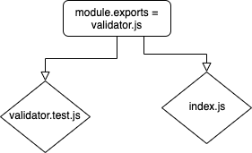

# LAB - 01

## Type & Object Validation

### Author: Lindsay Peltier

### Links and Resources

- [submission PR](https://github.com/LindsayPeltier-401-advanced-javascript/Apprenti-401-Lab-01/pull/1)
- [travis](https://www.travis-ci.com/LindsayPeltier-401-advanced-javascript/Apprenti-401-Lab-01/builds/144381809)

### Setup

'npm install'

#### Tests

- How do you run tests?
  'npm test'

### UML

//UML credit Trevor
